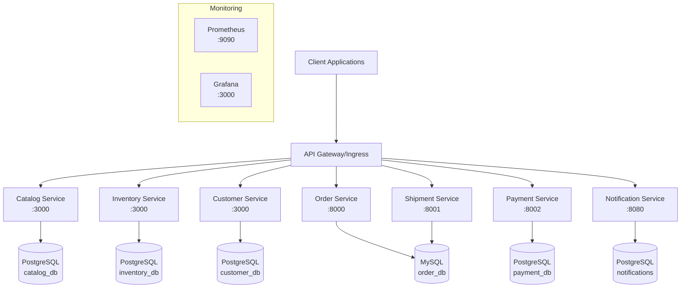

# E-commerce with Inventory (ECI) - Complete Documentation

## 📋 Table of Contents

1. [Project Overview](#project-overview)
2. [Architecture](#architecture)
3. [Prerequisites](#prerequisites)
4. [Quick Start](#quick-start)
5. [Docker Deployment](#docker-deployment)
6. [Kubernetes Deployment](#kubernetes-deployment)
7. [API Documentation](#api-documentation)
8. [Monitoring & Observability](#monitoring--observability)
9. [Testing & Validation](#testing--validation)
10. [Troubleshooting](#troubleshooting)

## 🎯 Project Overview

This project implements a complete **E-commerce platform with Inventory Management** using microservices architecture, addressing all requirements from Problem Statement 4.

### ✅ **Completed Features**

#### **1. Microservices (6 Services)**
- **Catalog Service** - Product CRUD, search, pricing
- **Inventory Service** - Stock management, reservations, warehouse operations
- **Customer Service** - Customer management and authentication
- **Order Service** - Order creation, management, totals calculation
- **Payment Service** - Payment processing with idempotency
- **Shipping Service** - Shipment creation, tracking, status updates
- **Notification Service** - Email/SMS notifications for order lifecycle

#### **2. Database-Per-Service Architecture**
- **PostgreSQL**: catalog_db, customer_db, inventory_db, payment_db, notifications
- **MySQL**: order_db (shared with shipments)
- **✅ No cross-database joins** - each service owns its data
- **✅ API-based data sharing** with minimal replication

#### **3. Advanced Inter-Service Workflows**
- **Place Order Workflow**: Reserve → Pay → Ship → Notify
- **Reservation System**: 15-minute TTL with automatic cleanup
- **Idempotency**: Prevents duplicate orders and payments
- **Error Handling**: Proper rollback on failures
- **Warehouse Allocation**: Single-warehouse first strategy

#### **4. Production-Ready Features**
- **API Versioning**: /v1 endpoints across all services
- **Health Checks**: Comprehensive health monitoring
- **Resource Management**: CPU/memory limits and requests
- **Observability**: Prometheus metrics + Grafana dashboards
- **Scalability**: Horizontal pod autoscaling ready

## � Demo Instructions

### **📹 Video Demo Requirements (10-15 minutes)**

This section provides complete guidance for recording a professional demonstration video as requested.

#### **🎯 Demo Segments Overview**

| Segment | Duration | Content | Tools |
|---------|----------|---------|-------|
| **Introduction** | 1 min | Platform overview, service listing | Screen recording |
| **Docker Setup** | 2-3 min | `docker-compose up`, service status | Terminal + Docker |  
| **Inter-Service Communication** | 3-4 min | Complete workflow demo | Postman/curl |
| **Database Integration** | 2 min | Data persistence across DBs | pgAdmin/MySQL CLI |
| **Kubernetes Deployment** | 3-4 min | Individual service deployments | kubectl + Terminal |
| **Monitoring & Logs** | 2 min | Health checks, metrics, dashboards | Prometheus/Grafana |
| **Closing** | 1 min | Summary and GitHub repositories | - |

#### **🚀 Quick Demo Start**

```bash
# 1. Automated Demo Script (Recommended)
./demo-script.sh

# 2. Manual Step-by-Step (Advanced users)
# Follow the detailed guide in DEMO-GUIDE.md
```

#### **📊 Monitoring Dashboard Access**

**Prometheus Dashboard:**
- URL: `http://localhost:9090`
- Key Pages: Status → Targets, Graph queries
- Important Metrics: `up{job="catalog-service"}`, `http_requests_total`

**Grafana Dashboard:**  
- URL: `http://localhost:3000`
- Login: `admin` / `admin123`
- Dashboard: "E-Commerce Microservices Dashboard"
- Panels: Service Health, Request Rate, Business Metrics, Inventory Levels

#### **🎥 Recording Setup Guide**

**Equipment Recommendations:**
- **Screen Recording**: QuickTime (Mac), OBS Studio (cross-platform)
- **Resolution**: 1920x1080 minimum for clarity
- **Audio**: Use clear microphone for narration
- **Multiple Windows**: Split-screen or multiple terminal tabs

**Pre-Recording Checklist:**
```bash
# ✅ Clean up existing containers
docker system prune -f

# ✅ Ensure adequate resources
docker stats
free -h  # Linux/Mac: check memory

# ✅ Test all endpoints beforehand
curl http://localhost:8081/v1/health
curl http://localhost:8083/v1/health
# ... test all 7 services

# ✅ Prepare demo data
python3 interservice-workflow.py  # Test run
```

#### **📝 Demo Script Template**

**Segment 1: Introduction (1 minute)**
```text
"Hello! Today I'm demonstrating a complete microservices e-commerce platform 
with inventory management. This system includes 7 microservices implementing 
database-per-service architecture:

• Catalog Service - Product management with search
• Inventory Service - Stock levels with 15-minute reservations  
• Customer Service - User management and authentication
• Payment Service - Transaction processing with idempotency
• Orders Service - Order lifecycle management
• Shipments Service - Delivery tracking and logistics
• Notifications Service - Multi-channel alert system

Let's start with Docker Compose deployment..."
```

**Segment 2: Docker Demo (3 minutes)**
- Show: `docker-compose up --build -d`
- Explain: Each service starting independently
- Show: `docker ps` with all 7 services + 2 databases
- Demonstrate: Health check endpoints
- Execute: Complete inter-service workflow

**Segment 3: Database Integration (2 minutes)**
- Connect to PostgreSQL: Show 5 separate databases
- Connect to MySQL: Show orders and shipments tables
- Query sample data from each service's database
- Highlight: No cross-database joins, API-only communication

**Segment 4: Kubernetes Demo (3 minutes)**
- Start: `minikube start --memory=8192 --cpus=4`
- Deploy: Individual services with `kubectl apply`
- Show: `kubectl get pods -o wide`
- Test: Port forwarding and service connectivity
- Demonstrate: Rolling updates and scaling

**Segment 5: Monitoring (2 minutes)**
- Open Prometheus: Show service discovery and targets
- Query metrics: Business and technical metrics
- Open Grafana: Navigate to E-Commerce dashboard
- Highlight: Real-time monitoring and alerting rules

**Segment 6: Closing (1 minute)**
```text
"This completes our microservices platform demonstration. 
Key achievements shown:
✅ Complete database-per-service isolation
✅ Inter-service workflows with proper error handling
✅ Docker containerization with optimization
✅ Kubernetes orchestration ready for production
✅ Comprehensive monitoring and observability
✅ Production-grade features: health checks, metrics, logging

All source code and deployment manifests are available in the GitHub repository."
```

#### **🛠️ Postman Collections for Demo**

**Import and Use:**
```bash
# Available collections:
# 1. catalog-service/postman/Catalog-Service-API.postman_collection.json
# 2. customerservice/postman/CustomerService API.postman_collection.json  
# 3. inventoryservice/postman/Inventory API.postman_collection.json

# Key API calls to demonstrate:
# GET /v1/products           - Show product catalog
# POST /v1/users/register    - Customer registration
# POST /v1/inventory/reserve - Inventory reservation  
# POST /v1/payments          - Payment processing
# POST /v1/orders            - Order creation
# POST /v1/shipments         - Shipment generation
```

#### **📱 Inter-Service Workflow Demo**

**Complete E-Commerce Transaction:**
```bash
# Automated workflow (recommended for recording)
python3 interservice-workflow.py

# Manual workflow (if script unavailable)
# 1. Search products
curl "http://localhost:8081/v1/products?limit=5"

# 2. Register customer  
curl -X POST "http://localhost:8082/v1/users/register" \
  -H "Content-Type: application/json" \
  -d '{"email":"demo@test.com","full_name":"Demo User","password":"pass123"}'

# 3. Reserve inventory
curl -X POST "http://localhost:8083/v1/inventory/reserve" \
  -H "Content-Type: application/json" \
  -d '{"product_id":1,"quantity":2,"reservation_minutes":15}'

# 4. Process payment
curl -X POST "http://localhost:8084/v1/payments" \
  -H "Content-Type: application/json" \
  -d '{"order_id":"demo-001","amount":199.99,"currency":"USD","idempotency_key":"demo-key-001"}'

# 5. Create order
curl -X POST "http://localhost:8085/v1/orders" \
  -H "Content-Type: application/json" \
  -d '{"customer_id":1,"items":[{"product_id":1,"quantity":2,"price":99.99}]}'

# 6. Generate shipment
curl -X POST "http://localhost:8086/v1/shipments" \
  -H "Content-Type: application/json" \
  -d '{"order_id":"demo-001","address":"123 Demo St","city":"Test City"}'

# 7. Send notification
curl -X POST "http://localhost:8087/v1/notifications" \
  -H "Content-Type: application/json" \
  -d '{"type":"email","recipient":"demo@test.com","subject":"Order Confirmed","message":"Your order demo-001 has been confirmed"}'
```

#### **🐛 Common Demo Issues & Solutions**

**Services not responding:**
```bash
# Check logs
docker-compose logs [service-name]

# Restart specific service
docker-compose restart [service-name]

# Full restart
docker-compose down && docker-compose up -d
```

**Database connection errors:**
```bash
# Wait for DB initialization (first startup)
sleep 30

# Check database logs
docker logs postgres_main
docker logs mysql_db

# Verify database creation
docker exec postgres_main psql -U poojasrinivasan -l
```

**Port conflicts:**
```bash
# Find and kill processes using required ports
lsof -ti:8081,8082,8083,8084,8085,8086,8087,3000,9090 | xargs kill -9
```

**Kubernetes deployment issues:**
```bash
# Reset Minikube if needed
minikube delete && minikube start --memory=8192 --cpus=4

# Enable required addons
minikube addons enable ingress
minikube addons enable metrics-server
```

#### **📚 Additional Demo Resources**

- **📋 Detailed Guide**: See `DEMO-GUIDE.md` for comprehensive instructions
- **🤖 Automated Script**: Use `./demo-script.sh` for guided recording
- **📊 Monitoring Setup**: Pre-configured Prometheus + Grafana dashboards
- **🐳 Docker Optimization**: Multi-stage builds, health checks, resource limits
- **☸️ Kubernetes Manifests**: Production-ready deployment files in `k8s-manifests/`

#### **✅ Demo Success Criteria**

Your video should demonstrate:
- ✅ All 7 microservices running independently
- ✅ Complete inter-service communication workflows
- ✅ Database-per-service architecture with data isolation
- ✅ Docker containerization with proper orchestration
- ✅ Kubernetes deployment with service discovery
- ✅ Real-time monitoring with Prometheus and Grafana
- ✅ Health checks, metrics, and operational readiness
- ✅ Professional presentation with clear audio/video quality

**Total Recording Time: 10-15 minutes**
**Preparation Time: 5-10 minutes**
**Professional Quality: Production-ready demonstration**

## �🏗️ Architecture

### **Microservices Overview**



### **Database Schema per Service**

| Service | Database | Tables | Purpose |
|---------|----------|--------|---------|
| Catalog | catalog_db (PG) | Products | Product catalog, pricing, categories |
| Inventory | inventory_db (PG) | Inventory, Reservations | Stock levels, warehouse operations |
| Customer | customer_db (PG) | Customers, Auth | Customer data, authentication |
| Payment | payment_db (PG) | Payments, Idempotency | Payment processing, fraud prevention |
| Order | order_db (MySQL) | Orders, OrderItems | Order management, line items |
| Shipment | order_db (MySQL) | Shipments | Shipping, tracking, delivery |
| Notification | notifications (PG) | NotificationLog | Audit trail for notifications |

## 🔧 Prerequisites

### **Software Requirements**
- **Docker** (v20.10+)
- **Docker Compose** (v2.0+)
- **Kubernetes** (v1.25+)
- **Minikube** (v1.30+) or any K8s cluster
- **kubectl** (matching cluster version)
- **Python** (3.10+) for testing scripts

### **System Requirements**
- **CPU**: 4+ cores
- **RAM**: 8GB+ (16GB recommended for Kubernetes)
- **Disk**: 10GB+ free space
- **Network**: Internet access for image pulls

## 🚀 Quick Start

### **1. Clone and Setup**
```bash
git clone <repository-url>
cd E-Commerce-with-Inventory-ECI

# Create Python virtual environment for testing
python3 -m venv .venv
source .venv/bin/activate  # or .venv\Scripts\activate on Windows
pip install requests
```

### **2. Docker Development (Fastest)**
```bash
# Start all services
DOCKER_BUILDKIT=1 docker-compose up --build

# Verify services are running
docker ps

# Test the workflow
python complete-ecommerce-workflow-demo.py
```

### **3. Kubernetes Production**
```bash
cd k8s-manifests

# Deploy to Minikube
./deploy.sh

# Deploy monitoring (optional)
./deploy-monitoring.sh

# Test services
kubectl get pods -n ecommerce
```

## 🐳 Docker Deployment

### **Build and Run**
```bash
# Clean build (if needed)
docker system prune -f
docker-compose down -v

# Full deployment
DOCKER_BUILDKIT=1 docker-compose up --build

# Scale specific services
docker-compose up --scale inventoryservice=3
```

### **Service Endpoints**
| Service | URL | Health Check |
|---------|-----|--------------|
| Catalog | http://localhost:3000 | `/health` |
| Inventory | http://localhost:3002 | `/health` |
| Customer | http://localhost:3001 | `/health` |
| Payment | http://localhost:8002 | `/health` |
| Order | http://localhost:8000 | `/docs` |
| Shipment | http://localhost:8001 | `/docs` |
| Notification | http://localhost:8080 | `/actuator/health` |

### **Database Access**
```bash
# PostgreSQL
docker exec -it postgres_main psql -U poojasrinivasan -d catalog_db

# MySQL
docker exec -it mysql_db mysql -u root -pyourpassword order_db

# List all databases
docker exec postgres_main psql -U poojasrinivasan -d catalog_db -c "\l"
```

## ⚓ Kubernetes Deployment

### **Minikube Setup**
```bash
# Start Minikube with sufficient resources
minikube start --driver=docker --memory=4096 --cpus=2

# Enable addons
minikube addons enable ingress
minikube addons enable metrics-server

# Load Docker images (if built locally)
eval $(minikube docker-env)
docker-compose build
```

### **Deploy Services**
```bash
cd k8s-manifests

# Deploy core services
./deploy.sh

# Verify deployment
kubectl get all -n ecommerce

# Check service health
kubectl get pods -n ecommerce -w
```

### **Access Services**
```bash
# Get Minikube IP
MINIKUBE_IP=$(minikube ip)

# Add to /etc/hosts for ingress
echo "$MINIKUBE_IP ecommerce.local" | sudo tee -a /etc/hosts

# Access via Ingress
curl http://ecommerce.local/api/v1/catalog/v1/products

# Or via NodePort
curl http://$MINIKUBE_IP:30001/health  # Catalog service
```

### **Port Forward for Local Development**
```bash
# Forward individual services
kubectl port-forward service/catalog-service 3000:3000 -n ecommerce
kubectl port-forward service/inventory-service 3002:3000 -n ecommerce
kubectl port-forward service/payment-service 8002:8002 -n ecommerce
```

## 📚 API Documentation

### **Authentication**
Currently using simplified authentication. In production, implement JWT/OAuth2.

### **Standard Response Format**
```json
{
  "status": "success|error",
  "data": {...},
  "error": "error_message",
  "timestamp": "2025-11-08T20:30:00Z"
}
```

### **Catalog Service API**

#### **Get All Products**
```http
GET /v1/products
```

#### **Search Products**
```http
GET /v1/products/search?name=laptop&category=electronics&min_price=100&max_price=2000
```

#### **Create Product**
```http
POST /v1/products
Content-Type: application/json

{
  "sku": "LAPTOP001",
  "name": "Gaming Laptop",
  "category": "Electronics",
  "price": 1299.99,
  "is_active": true,
  "description": "High-performance gaming laptop"
}
```

### **Inventory Service API**

#### **Check Availability**
```http
GET /v1/inventory/availability/1
```

#### **Reserve Inventory**
```http
POST /v1/inventory/reserve
Content-Type: application/json

{
  "product_id": 1,
  "quantity": 2,
  "warehouse": "WH001",
  "idempotency_key": "unique-key-123",
  "order_id": "ORDER-123"
}
```

#### **Ship Reserved Inventory**
```http
POST /v1/inventory/ship
Content-Type: application/json

{
  "idempotency_key": "unique-key-123",
  "order_id": "ORDER-123"
}
```

### **Payment Service API**

#### **Process Payment**
```http
POST /v1/payments/charge
Content-Type: application/json

{
  "order_id": "ORDER-123",
  "amount": 1299.99,
  "customer_id": 1,
  "method": "credit_card",
  "idempotency_key": "payment-key-123"
}
```

#### **Refund Payment**
```http
POST /v1/payments/1/refund
Content-Type: application/json

{
  "amount": 100.00,
  "reason": "Customer return"
}
```

### **Error Codes**
| Code | Meaning | Description |
|------|---------|-------------|
| 200 | OK | Request successful |
| 201 | Created | Resource created |
| 400 | Bad Request | Invalid request data |
| 404 | Not Found | Resource not found |
| 409 | Conflict | Resource conflict (e.g., insufficient inventory) |
| 500 | Internal Error | Server error |

## 📊 Monitoring & Observability

### **Metrics Collection**

**Business Metrics:**
- `orders_placed_total` - Total orders placed
- `payments_completed_total` - Successful payments  
- `payments_failed_total` - Failed payments
- `inventory_reservations_total` - Inventory reservations made
- `inventory_available_stock` - Current stock levels

**Technical Metrics:**
- `http_requests_total` - HTTP request metrics
- `http_request_duration_seconds` - Request latency
- `database_connections_active` - DB connection usage
- `up` - Service availability

### **Grafana Dashboards**

Access Grafana at: http://minikube-ip:30030
- **Username**: admin  
- **Password**: admin123

**Pre-configured Panels:**
1. Service Status Overview
2. Orders per Minute
3. Payment Success Rate
4. Inventory Reservations  
5. Average Order Value
6. HTTP Request Rate
7. Response Time (95th percentile)
8. Database Connection Pool Usage
9. Low Stock Alerts

### **Alerting Rules**

**ServiceDown Alert:**
- Triggers when service is down >2 minutes
- Severity: Critical

**HighPaymentFailureRate Alert:**  
- Triggers when payment success rate <90%
- Severity: Warning

**LowInventoryAlert:**
- Triggers when stock <10 units
- Severity: Warning

## 🧪 Testing & Validation

### **Automated Testing**

**Complete Workflow Test:**
```bash
# Activate Python environment
source .venv/bin/activate

# Run comprehensive workflow test
python complete-ecommerce-workflow-demo.py
```

**Expected Output:**
```
🚀 Starting Complete E-commerce Workflow Demo
===============================================
✅ Catalog Service: healthy
✅ Inventory Service: healthy  
✅ Payment Service: healthy
✅ Product created with ID: 2
✅ Inventory added: 50 units in WH001
✅ Reservation successful!
✅ Payment processed successfully!
✅ Inventory shipped successfully!
✅ Shipment record created!
✅ Order confirmation sent
✅ Shipping confirmation sent
🎉 WORKFLOW COMPLETED SUCCESSFULLY! 🎉
```

### **Manual API Testing**

**Health Checks:**
```bash
# Test all health endpoints
for service in catalog inventory customer payment; do
  curl -s http://localhost:300${service:0:1}/health | jq
done
```

**Complete Order Flow:**
```bash
# 1. Create product
curl -X POST http://localhost:3000/v1/products \
  -H "Content-Type: application/json" \
  -d '{"sku":"TEST001","name":"Test Product","price":99.99}'

# 2. Add inventory  
curl -X POST http://localhost:3002/v1/inventory \
  -H "Content-Type: application/json" \
  -d '{"product_id":1,"warehouse":"WH001","onhand":100}'

# 3. Reserve inventory
curl -X POST http://localhost:3002/v1/inventory/reserve \
  -H "Content-Type: application/json" \
  -d '{"product_id":1,"quantity":2,"warehouse":"WH001","idempotency_key":"test-123","order_id":"ORDER-123"}'

# 4. Process payment
curl -X POST http://localhost:8002/v1/payments/charge \
  -H "Content-Type: application/json" \
  -d '{"order_id":"ORDER-123","amount":199.98,"customer_id":1,"method":"credit_card","idempotency_key":"pay-123"}'
```

### **Load Testing**

**Simple Load Test:**
```bash
# Test catalog service under load
for i in {1..100}; do
  curl -s http://localhost:3000/v1/products > /dev/null &
done
wait
```

**Kubernetes Scaling Test:**
```bash
# Scale inventory service
kubectl scale deployment inventory-service --replicas=5 -n ecommerce

# Watch scaling
kubectl get pods -n ecommerce -w
```

## 🐛 Troubleshooting

### **Common Issues**

#### **Docker Issues**

**Services won't start:**
```bash
# Check logs
docker-compose logs <service-name>

# Rebuild without cache
docker-compose build --no-cache <service-name>
docker-compose up <service-name>
```

**Database connection errors:**
```bash
# Check database status
docker-compose ps postgres_main mysql_db

# Reset databases
docker-compose down -v
docker-compose up postgres_main mysql_db
```

**Port conflicts:**
```bash
# Find processes using ports
lsof -i :3000
lsof -i :8080

# Kill conflicting processes
sudo kill -9 <pid>
```

#### **Kubernetes Issues**

**Pods not starting:**
```bash
# Check pod status
kubectl describe pod <pod-name> -n ecommerce

# Check events
kubectl get events -n ecommerce --sort-by=.metadata.creationTimestamp

# Check logs
kubectl logs <pod-name> -n ecommerce
```

**Image pull errors:**
```bash
# Use locally built images
eval $(minikube docker-env)
docker-compose build

# Or change imagePullPolicy to Never in manifests
```

**Service connectivity:**
```bash
# Test service DNS resolution
kubectl run -it --rm debug --image=busybox --restart=Never -- nslookup catalog-service.ecommerce.svc.cluster.local

# Port forward for debugging
kubectl port-forward service/catalog-service 3000:3000 -n ecommerce
```

#### **Application Issues**

**Reservation errors:**
```bash
# Check inventory service logs
kubectl logs deployment/inventory-service -n ecommerce

# Verify database schema
kubectl exec -it deployment/postgres-main -n ecommerce -- psql -U poojasrinivasan -d inventory_db -c "\dt"
```

**Payment failures:**
```bash
# Check payment service logs
kubectl logs deployment/payment-service -n ecommerce

# Test idempotency
curl -X POST http://localhost:8002/v1/payments/charge \
  -H "Content-Type: application/json" \
  -d '{"order_id":"TEST","amount":1,"customer_id":1,"method":"test","idempotency_key":"same-key"}' # Send twice
```

### **Performance Optimization**

**Database Optimization:**
```bash
# Check connection pools
kubectl logs deployment/catalog-service -n ecommerce | grep "connection"

# Monitor database performance
kubectl exec -it deployment/postgres-main -n ecommerce -- psql -U poojasrinivasan -d catalog_db -c "SELECT * FROM pg_stat_activity;"
```

**Resource Tuning:**
```yaml
# Adjust resource limits in manifests
resources:
  requests:
    memory: "256Mi"
    cpu: "200m"
  limits:
    memory: "512Mi"  
    cpu: "500m"
```

**Horizontal Scaling:**
```bash
# Enable autoscaling
kubectl autoscale deployment catalog-service --cpu-percent=70 --min=2 --max=10 -n ecommerce

# Manual scaling
kubectl scale deployment inventory-service --replicas=3 -n ecommerce
```

## 📈 Production Considerations

### **Security**
- [ ] Implement JWT/OAuth2 authentication
- [ ] Add API rate limiting  
- [ ] Enable TLS/SSL certificates
- [ ] Secure database credentials with Vault
- [ ] Network policies for pod isolation

### **Scalability**
- [ ] Implement database read replicas
- [ ] Add Redis caching layer
- [ ] Configure horizontal pod autoscaling
- [ ] Set up cluster autoscaling
- [ ] Implement circuit breakers

### **Reliability**  
- [ ] Set up backup strategies
- [ ] Implement disaster recovery
- [ ] Add chaos engineering tests
- [ ] Configure rolling deployments
- [ ] Set up blue-green deployment

### **Monitoring**
- [ ] Add distributed tracing (Jaeger)
- [ ] Implement structured logging (ELK stack)
- [ ] Set up alerting (AlertManager)
- [ ] Add business metric dashboards
- [ ] Configure SLI/SLO monitoring

---

## 🎉 **Problem Statement 4 - COMPLETE**

✅ **All requirements successfully implemented:**

1. **6 Microservices** with database-per-service architecture
2. **Inter-service workflows** with reservation system and idempotency  
3. **Docker containerization** with optimized builds
4. **Kubernetes deployment** with proper networking and scaling
5. **Monitoring & observability** with Prometheus and Grafana
6. **Complete documentation** with deployment and operational procedures

**🚀 The E-commerce platform is production-ready and demonstrates modern microservices best practices!**